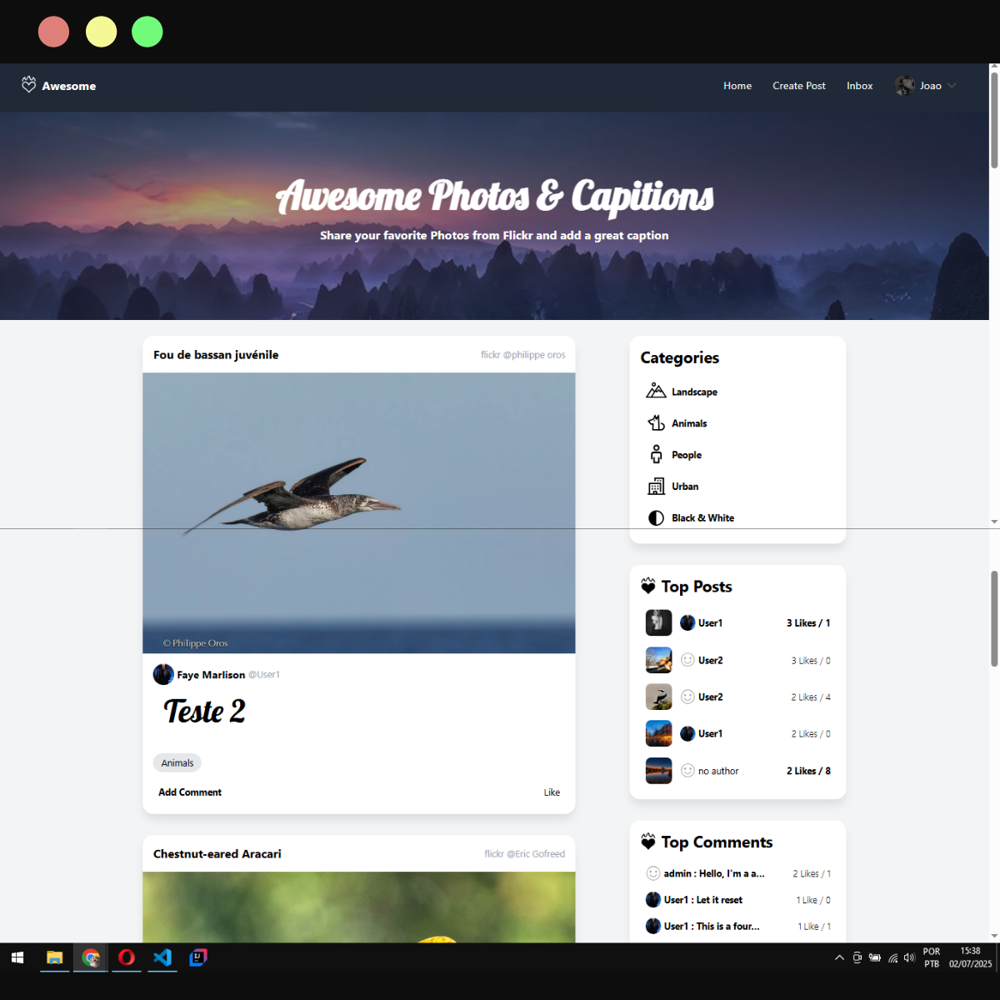
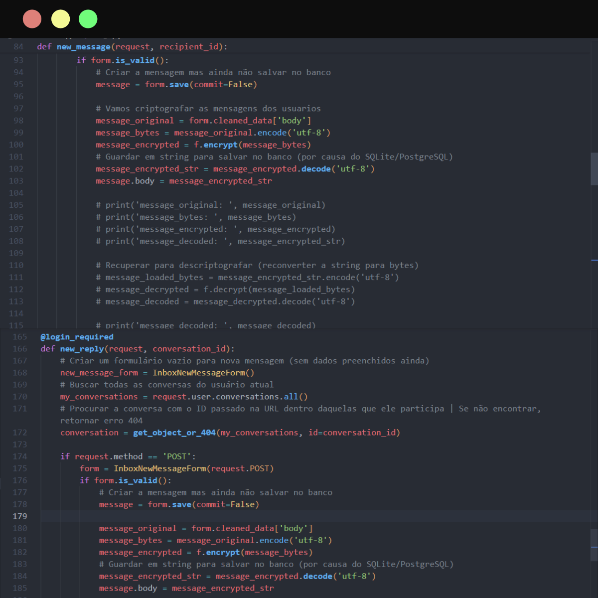

# FireBlog (Django 5 + HTMX)
> Um mini‑blog moderno com posts, comentários, respostas, likes e mensagens em tempo real.



Este repositório contém meu projeto finalizado de um site completo desenvolvido com **Django**, como parte dos meus estudos de desenvolvimento web com Python. O projeto foi acompanhado através do canal do [Andreas Jud no YouTube](https://www.youtube.com/@ajudmeister), onde aprendi na prática a criar sistemas profissionais com Django, HTML, Bootstrap e integração com o HTMX.

🔗 O projeto original do Andreas jud pode ser visualizado online aqui:  
👉 [https://awesomepixx.com](https://awesomepixx.com)

---

## Sobre o Projeto

Este projeto simula uma plataforma social com sistema de mensagens privadas entre usuários. Desenvolvi toda a estrutura do site utilizando as ferramentas e boas práticas ensinadas por Andreas Jub.

Funcionalidades implementadas:

- ✔ Sistema de autenticação (login e cadastro de usuários)
- ✔ Sistema de **inbox (mensagens privadas)**
- ✔ Criptografia de mensagens com **Fernet**
- ✔ Upload de imagem de perfil e dados do usuário
- ✔ Buscador dinâmico de usuários com **HTMX**
- ✔ Notificações de mensagens não lidas
- ✔ Interface responsiva com **Bootstrap**
- ✔ Painel administrativo personalizado

---

## 🔐 Criptografia de Mensagens

As mensagens enviadas entre usuários são criptografadas utilizando a biblioteca `cryptography`, com o algoritmo **Fernet**.  
Isso garante que o conteúdo armazenado no banco de dados esteja seguro e só possa ser lido após ser decriptografado pelo sistema, nas views `new_message` e `new_reply`.



Além disso, o painel administrativo foi configurado para que o **admin do site não possa visualizar, editar ou enviar mensagens** dos usuários através do Django Admin.

---

## Aprendizado com HTMX

Implementei **busca dinâmica de usuários** e **notificações automáticas** usando a biblioteca **HTMX**, que permite criar páginas mais interativas sem a complexidade do JavaScript tradicional.

O uso de HTMX no projeto me ensinou a:

Implementei **busca dinâmica de usuários**, **notificações automáticas** e **carregamento parcial de templates HTML** usando a biblioteca **HTMX**.

O uso de HTMX no projeto me ensinou a:

- Fazer requisições assíncronas sem escrever JavaScript
- Atualizar partes do HTML dinamicamente (componentes parciais com `hx-get`, `hx-target`, `hx-swap`)
- Criar uma experiência fluida e moderna com Django + HTMX

---

## 📁 Estrutura do Projeto

```
EstudosDjango/
├── a_core/              # App com funcionalidades centrais do projeto
├── a_inbox/             # App de mensagens privadas (inbox com HTMX)
├── a_posts/             # App de criação e exibição de posts
├── a_users/             # App de gerenciamento de usuários e perfis
├── config/              # Configurações do projeto Django (settings, urls, etc.)
├── media/               # Arquivos enviados pelos usuários (imagens de perfil, etc.)
├── templates/           # Templates HTML e parciais usados com HTMX
├── static/              # Arquivos estáticos (CSS, JS, imagens)
├── db.sqlite3           # Banco de dados local
├── manage.py            # Gerenciador de comandos do Django
└── .gitignore           # Arquivo para ignorar pastas/arquivos no Git
```

---

## ⚙️ Como Rodar Localmente

1. Clone o repositório:

```bash
git clone https://github.com/SabrinaGamaa/EstudosDjango.git
cd EstudosDjango
```

2. Crie um ambiente virtual:

```bash
python -m venv .venv
source .venv/bin/activate      # Linux/Mac
.venv\Scripts\activate         # Windows
```

3. Instale as dependências:

```bash
pip install -r requirements.txt
```

4. Gere uma chave Fernet para criptografia:

```python
from cryptography.fernet import Fernet
print(Fernet.generate_key())
```

5. Copie a chave gerada e adicione no `settings.py`:

```python
ENCRYPT_KEY = b'sua_chave_aqui'
```

6. Rode as migrações e o servidor:

```bash
python manage.py migrate
python manage.py runserver
```

---

## 📚 Tecnologias e Conceitos Aprendidos

- Python 3.13 e Django
- Views, Models, Forms e Admin do Django
- Templates com contexto dinâmico
- HTMX para interações em tempo real (sem JS)
- Carregamento de templates parciais com HTMX
- Criptografia com `cryptography.Fernet`
- Bootstrap 5 para responsividade
- SQLite como banco local
- Autenticação de usuários
- Manipulação de arquivos de imagem
- Upload e exibição de fotos de perfil
- Filtros no Django ORM (QuerySets dinâmicos)
- Organização do projeto em múltiplos apps Django

---

## 📺 Créditos

Este projeto foi desenvolvido com base nos ensinamentos do canal  
🎥 [Andreas Jud - Desenvolvimento Web com Djando e HTMX](https://www.youtube.com/@ajudmeister)

🔗 Projeto final online de referência: [https://awesomepixx.com](https://awesomepixx.com)

--- 

> *Feito com ☕, ❤️ e uma pitada de HTMX!*

